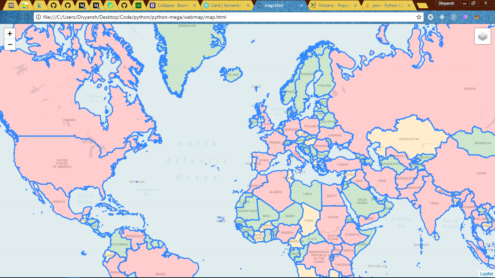

# Visual Analytics 

A webmap based in python with visual analytics of all the volcanoes around the world, their risk factors and populations 
around the world 

## Getting Started
```
* Clone the repo.
* Install the dependencies 
	- Pandas
	- Folium
* run map.py
* Then start map.html
```

### Prerequisites

What things you need to install the software and how to install them

```
* Python 3
* Pandas
* Folium
```

## Built With

* [Python3](https://www.python.org) - The programming language
* [Pandas](https://www.pandas.org) - The data analysing library
* [Folium](https://www.folium.org) - The Webmap creating library

## Authors

* **Divyansh Dwivedi** - *Initial work*

## Screenshot





